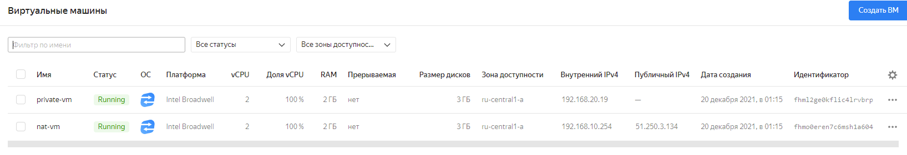
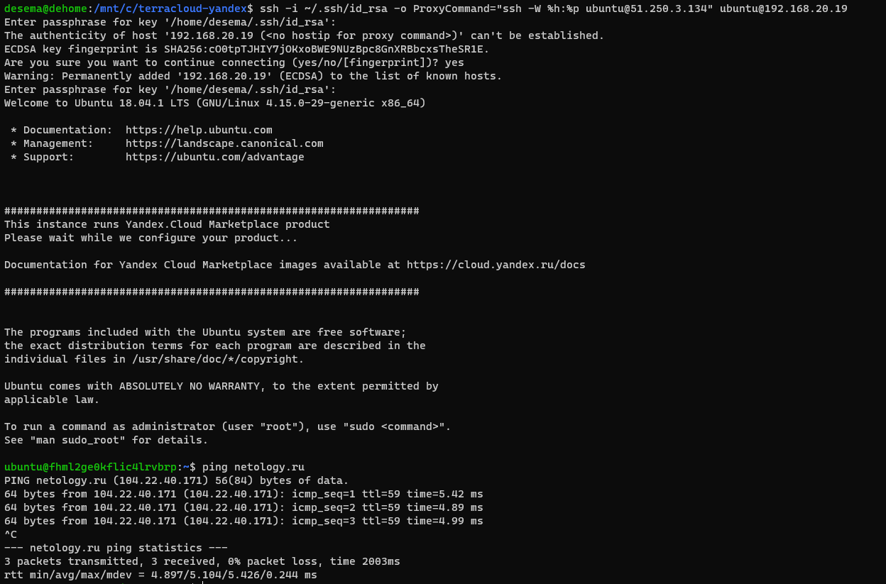

# Домашнее задание к занятию "15.1. Организация сети"

подготовил конфиг для подключения и создания сети/вмок:

```terraform
terraform {
  required_providers {
    yandex = {
      source  = "yandex-cloud/yandex"
      version = "0.61.0"
    }
  }
}

provider "yandex" {
  token     = var.YC_TOKEN
  cloud_id  = "b1ge9kc6o4mjqkq8g442"
  folder_id = "b1g4b2ub71c1gaf00cp8"
  zone      = "ru-central1-a"
}

resource "yandex_vpc_network" "terra_network" {
  name = "terra_network"
}

resource "yandex_vpc_subnet" "public" {
  name           = "public"
  zone           = "ru-central1-a"
  network_id     = yandex_vpc_network.terra_network.id
  v4_cidr_blocks = ["192.168.10.0/24"]
}

resource "yandex_vpc_subnet" "private" {
  name           = "private"
  zone           = "ru-central1-a"
  network_id     = yandex_vpc_network.terra_network.id
  v4_cidr_blocks = ["192.168.20.0/24"]
  route_table_id  = yandex_vpc_route_table.route-to-nat.id
}

resource "yandex_vpc_route_table" "route-to-nat" {
  network_id = "${yandex_vpc_network.terra_network.id}"

  static_route {
    destination_prefix = "0.0.0.0/0"
    next_hop_address   = "192.168.10.254"
  }
}

resource "yandex_compute_instance" "nat-vm" {
  name = "nat-vm"

  resources {
    cores  = 2
    memory = 2
  }

  boot_disk {
    initialize_params {
      image_id = "fd80mrhj8fl2oe87o4e1"
    }
  }

  network_interface {
    subnet_id = yandex_vpc_subnet.public.id
    nat       = true
	ip_address = "192.168.10.254"
  }

  metadata = {
    ssh-keys = "ubuntu:${file("~/.ssh/id_rsa.pub")}"
  }
}

resource "yandex_compute_instance" "private-vm" {
  name = "private-vm"

  resources {
    cores  = 2
    memory = 2
  }

  boot_disk {
    initialize_params {
      image_id = "fd80mrhj8fl2oe87o4e1"
    }
  }

  network_interface {
    subnet_id = yandex_vpc_subnet.private.id
  }

  metadata = {
    ssh-keys = "ubuntu:${file("~/.ssh/id_rsa.pub")}"
  }
}

output "internal_ip_address_nat_vm" {
  value = yandex_compute_instance.nat-vm.network_interface.0.ip_address
}

output "external_ip_address_nat_vm" {
  value = yandex_compute_instance.nat-vm.network_interface.0.nat_ip_address
}
output "internal_ip_address_private_vm" {
  value = yandex_compute_instance.private-vm.network_interface.0.ip_address
}
```
посмотрим на вывод терраформа и убедимся в гуе что ресурсы создались:

<br>

<br>

<br>

<br>


Как видим, всё создалось корректно. теперь проверим доступ с первой вм:


А теперь со второй вм, водключенной к rivate подсети:


